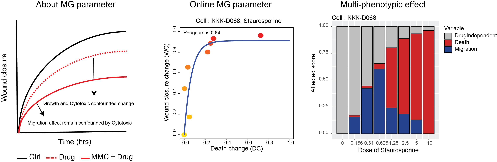

# mgcalculator

Create migration-death relationship from would healing assay.

An online tool: [https://sisp.shinyapps.io/MGCalculator/](https://sisp.shinyapps.io/MGCalculator/)

### Introduction

Wound healing assay has been used ubiquitously for the assessment of cell migration in biomedical research but was also known to be confounded by complex influences of multiple cellular phenotypes. We have demonstrated in this study how to modify the standard wound healing assay for accurate scoring of different phenotypic contributions. Since the conventional wound healing assay cannot be used for scoring the contributions of different phenotypes, past efforts in identifying potential inhibitors of cell migration often misinterpret phenotypic influences by different compounds. By concurrent monitoring of wound closure change together with cell death quantification, we showed that therapeutic effects on cellular phenotypes can be scored based on the established relationship of wound closure rate and changes of cell death at different drug concentrations. Fractional contribution of cell death and cell migration can then be approximated from the slope of the fitted relationship.



**Fig. 1**: The established relationship between cumulative changes of caspase signal and relative wound density (RWD) changes at different drug concentrations (left). Scoring of therapeutic impacts on different phenotypics at increasing drug concentrations. (right).


### Calculation of cell migration/death scores:

To separate the contribution of cell migration and cell death from the observed delayed in wound closure, we generated the relationship of the cumulative changes of cell death signal and the relative wound density.

For calculation of “wound closure change” ($`WC_{xi}`$), we determined the AUC of the RWD from each drug treatment condition ($`AUC(RWD)_{xi}`$) and normalized this value by that from the DMSO control group ($`AUC(RWD)_{ctrl}`$), all with MMC pre-treatment.

```math
WC_{xi}=\frac{(AUC(RWD)_{ctrl}−AUC(RWD)_{xi})}{AUC(RWD)_{ctrl}}
```

It is important to note that some drug cannot completely inhibit wound closure while others can inhibit wound closure almost entirely. Thus, we define another parameter called drug-independent wound closure change ($`WC_{ind}`$) and can summarize the relationship between the two types of wound closure changes from the following equation:

```math
1=WC_{xi}+WC_{ind}
```
, where
```math
WC_{ind}=\frac{AUC(RWD)_{xi}}{AUC(RWD)_{ctrl}}
```

For “Death change” ($`DC_{xi}`$), we determined the area under curve from caspase 3/7 activity ($`AUC(D)_{xi}`$) at each drug treatment condition and normalized this value by that of the DMSO control ($`AUC(D)_{ctrl}`$), both with MMC pre-treatment.

```math
DC_{xi}=\frac{(AUC(D)_{xi}−AUC(D)_{ctrl})}{AUC(D)_{max}}
```

The data obtained from ($`WC_{xi}`$) and ($`DC_{xi}`$) were used to determine the contribution of cell death and cell migration from the drug-induced wound closure change. We attempted to capture this relationship by fitting with 1st-order rate equation. If the fitting quality is inadequate (i.e. $`r^2 < 0.6`$), a vertical straight line is used for fitting instead. If the fitting with straight line is favorable, we concluded that the observed wound change is dependent only on one cellular phenotype.

When the relationship is explainable by 1st order rate equation, we approximated the fractional contribution of cell migration and cell death by calculating the arctan of the slope ($`θ_{xi}`$ in radian). The summation of the migration score ($`Migration_{xi}`$) and death score ($`Death_{xi}`$) should be equal to the drug-induced wound closure change ($`WC_{xi}`$). Mathematically, such relationship can be defined as follows:

```math
WC_{xi}=Migration_{xi}+Death_{xi}
```
, where
```math
Death_{xi}=WC_{xi}×(\frac{θ_{xi}}{2})
```

### Publication:

Somchai, P., Phongkitkarun, K., Kueanjinda, P. et al. Novel Analytical Platform For Robust Identification of Cell Migration Inhibitors. Sci Rep 10, 931 (2020). [https://doi.org/10.1038/s41598-020-57806-0](https://doi.org/10.1038/s41598-020-57806-0)

### Funding Sources:

This work was funded by NSTDA (P-15-50208) and partially supported by Faculty of Medicine Siriraj Hospital, Mahidol University
